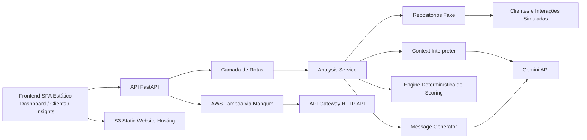

# Agentic Client Guardian
## AI Retention Engine for Financial Advisors

## Visão Geral
Agentic Client Guardian é um projeto full-stack de estudo, pensado como um MVP realista de produto para fluxos de retenção em assessoria financeira.

O sistema analisa comportamento de clientes simulados, estima risco de churn, prioriza contas, recomenda a próxima melhor ação e gera mensagens personalizadas para o assessor. O projeto foi construído com mentalidade de portfólio técnico: lógica de negócio clara, integração resiliente com IA, deploy em nuvem, validação pública e processo de limpeza para custo zero após a demonstração.

Este repositório foi estruturado para demonstrar o ciclo completo de engenharia:

- arquitetura de backend e modelagem de domínio
- scoring determinístico e tomada de decisão operacional
- integração com Gemini com retry e fallback
- experiência moderna de frontend
- deploy serverless na AWS
- validação pública da solução
- cleanup controlado para evitar custo residual

## Problema
Assessores financeiros precisam agir antes que o churn se torne visível em resultados concretos.

Na prática, os sinais de risco ficam espalhados entre:

- anotações de CRM
- interações recentes
- sentimento do cliente
- comportamento de aporte
- vencimentos de produtos
- lacunas de acompanhamento operacional

Isso gera dois problemas recorrentes:

- a priorização se torna reativa em vez de preventiva
- a qualidade da comunicação depende demais de interpretação manual

## Solução
Agentic Client Guardian propõe um motor leve de retenção com apoio de IA.

A plataforma combina dados estruturados do cliente, interações recentes, interpretação de contexto, scoring determinístico e geração de mensagem em um único fluxo operacional. Mesmo quando o LLM não está disponível, a aplicação continua funcionando por meio de um fallback totalmente validado.

Resultado de negócio esperado:

- identificar quem precisa de atenção
- explicar o motivo
- recomendar o próximo passo
- acelerar a ação do assessor

## Principais Funcionalidades
- Arquitetura em camadas com FastAPI e Pydantic
- Engine determinística de churn e prioridade com regras transparentes
- Integração com Gemini com estratégia de retry e fallback seguro
- Endpoint principal de análise em `POST /clients/{id}/analyze`
- Camada de dados fake para testes repetíveis sem banco real
- Geração de mensagens personalizadas em português do Brasil
- Frontend SPA moderno com `Dashboard`, `Clients` e `Insights`
- Linguagem visual fintech inspirada em Stitch, com estados de loading e erro
- Deploy serverless na AWS com Lambda + API Gateway via SAM
- Publicação do frontend em S3 static website hosting
- Docker, Docker Compose, CI com GitHub Actions e testes automatizados
- Suíte `pytest` com `36` testes passando

## Arquitetura


O backend foi desenvolvido com separação clara de responsabilidades:

- `db/` para dados fake determinísticos e abstração de repositório
- `models/` e `schemas/` para tipagem forte e contratos da API
- `services/` para scoring, interpretação, orquestração e geração de mensagem
- `api/` para rotas FastAPI e tratamento de resposta

Fluxo principal da aplicação:

1. carregar o cliente
2. carregar as interações recentes
3. interpretar o contexto com Gemini quando disponível
4. aplicar fallback heurístico local quando necessário
5. consolidar sinais operacionais
6. calcular churn e prioridade
7. gerar uma mensagem pronta para uso pelo assessor

## Stack Tecnológica
- Backend: FastAPI, Python 3.11+, Pydantic, HTTPX
- IA: Gemini API com retry e fallback
- Frontend: SPA estática em HTML/CSS/JavaScript, inspirada em design gerado por Stitch
- Interface local adicional: dashboard Streamlit para exploração do fluxo
- Infraestrutura: AWS Lambda, API Gateway HTTP API, AWS SAM
- Hospedagem estática: Amazon S3 static website hosting
- Containerização: Docker, Docker Compose
- CI: GitHub Actions
- Testes: pytest

## Estrutura do Projeto
```text
agentic-client-guardian/
  app/
    api/
    core/
    db/
    models/
    prompts/
    schemas/
    services/
    utils/
    lambda_handler.py
    main.py
  frontend/
    index.html
  tests/
  dashboard.py
  Dockerfile
  docker-compose.yml
  requirements.txt
  requirements-dev.txt
  template.yaml
  README.md
```

## Endpoints da API
| Método | Endpoint | Finalidade |
|---|---|---|
| `GET` | `/health` | Health check da aplicação |
| `GET` | `/clients` | Lista todos os clientes simulados |
| `GET` | `/clients/{client_id}` | Retorna um cliente específico |
| `GET` | `/clients/{client_id}/interactions` | Retorna as interações do cliente |
| `POST` | `/clients/{client_id}/analyze` | Executa a análise completa do cliente |
| `GET` | `/daily-priorities` | Retorna a fila ordenada por prioridade operacional |

Exemplos de uso:

```bash
curl http://127.0.0.1:8000/health
```

```bash
curl http://127.0.0.1:8000/clients
```

```bash
curl -X POST http://127.0.0.1:8000/clients/client-001/analyze
```

```bash
curl http://127.0.0.1:8000/daily-priorities
```

## Setup Local
1. Clone o repositório e entre na pasta do projeto.

```bash
git clone <url-do-seu-repo>
cd agentic-client-guardian
```

2. Crie e ative um ambiente virtual.

```bash
python -m venv .venv
.venv\Scripts\activate
```

3. Instale as dependências de desenvolvimento.

```bash
pip install -r requirements-dev.txt
```

4. Crie o arquivo de ambiente a partir do template.

```bash
copy .env.example .env
```

5. Suba a API localmente.

```bash
uvicorn app.main:app --reload
```

6. Abra a documentação da API.

```text
http://127.0.0.1:8000/docs
```

Variáveis de ambiente:

```env
GEMINI_API_KEY=your_gemini_api_key_here
GEMINI_MODEL=gemini-2.5-flash
```

Nenhuma chave de API é hardcoded neste repositório. Se `GEMINI_API_KEY` estiver ausente, a aplicação continua funcionando através do fluxo de fallback.

## Executando com Docker
Build da imagem da API:

```bash
docker build -t agentic-client-guardian .
```

Rodar a API em container:

```bash
docker run --rm -p 8000:8000 --env-file .env agentic-client-guardian
```

Rodar a stack local com Docker Compose:

```bash
docker compose up --build
```

O projeto também inclui:

- containerização da API para paridade local
- suporte a Compose para orquestração da demo
- setup de dependências compatível com CI

## Uso do Frontend
O frontend evoluiu de uma interface simples para uma SPA moderna com três áreas principais:

- `Dashboard`
- `Clients`
- `Insights`

O frontend de apresentação está em [frontend/index.html](C:/Users/vitor/OneDrive/Documentos/Playground/agentic-client-guardian/frontend/index.html) e foi pensado como uma interface estática de alta qualidade para demonstração, screenshots e showcase técnico.

Capacidades do frontend:

- navegação entre views
- loading states
- error states
- consumo da API pública
- visualização de detalhe do cliente
- fluxo de ação e mensagem
- camada de insights operacionais

Para uso local servido pela API, o backend expõe o frontend em:

```text
http://127.0.0.1:8000/ui/
```

Também existe uma interface complementar em Streamlit:

```bash
streamlit run dashboard.py
```

## Deploy AWS (Serverless)
O backend foi adaptado para execução serverless com AWS Lambda + API Gateway usando Mangum e AWS SAM.

Arquivos relevantes:

- [app/lambda_handler.py](C:/Users/vitor/OneDrive/Documentos/Playground/agentic-client-guardian/app/lambda_handler.py)
- [template.yaml](C:/Users/vitor/OneDrive/Documentos/Playground/agentic-client-guardian/template.yaml)

Fluxo de deploy:

```bash
sam build --use-container
sam deploy --guided
```

Ou de forma não interativa:

```bash
sam deploy --stack-name agentic-client-guardian-demo --resolve-s3 --capabilities CAPABILITY_IAM --no-confirm-changeset --no-fail-on-empty-changeset --parameter-overrides EnvironmentName=demo GeminiModel=gemini-2.5-flash
```

Destaques da implementação serverless:

- FastAPI adaptada para Lambda via `Mangum`
- trigger HTTP API do API Gateway
- configuração do Gemini por variável de ambiente
- nenhum segredo hardcoded
- fallback validado sem `GEMINI_API_KEY`
- CORS configurado corretamente no FastAPI e no API Gateway
- suporte a `OPTIONS` para consumo externo pelo frontend

## Demo Pública na AWS
Este projeto foi publicado publicamente de forma temporária para validar o ciclo completo de produto: implementação, deploy, teste e limpeza.

A demo pública incluiu:

- stack SAM: `agentic-client-guardian-demo`
- função Lambda: `agentic-client-guardian-d-AgenticClientGuardianFun-W1y7QvyrVGy9`
- API Gateway HTTP API: `xkskagocii`
- bucket S3 do frontend: `agentic-client-guardian-demo-ui-872515280667-20260322`
- static website hosting com `index.html` publicado

O que foi validado durante a demonstração pública:

- endpoint de saúde da API
- listagem de clientes
- fila de prioridades diárias
- fluxo completo via `/clients/{id}/analyze`
- integração do frontend com a API pública
- comportamento de CORS para frontend externo
- funcionamento do fallback sem `GEMINI_API_KEY`

Observações importantes:

- o deploy público foi temporário e usado apenas para screenshots e validação
- nenhum dado real de cliente foi utilizado
- nenhuma chave ou segredo foi exposto
- este README documenta o que foi feito, mesmo que a infraestrutura pública não esteja mais ativa

## Validação e Testes
A solução foi validada localmente e na AWS.

Status da suíte automatizada:

- `36 passed`

Rodar os testes localmente:

```bash
pytest
```

Endpoints validados:

- `GET /health`
- `GET /clients`
- `GET /daily-priorities`
- `POST /clients/{id}/analyze`

Comportamentos validados:

- fallback completo sem Gemini
- acesso público da API pela AWS
- frontend externo consumindo a API pública
- CORS e preflight
- execução local via Docker e Compose

Exemplos de validação:

```bash
curl https://xkskagocii.execute-api.us-east-1.amazonaws.com/health
```

```bash
curl https://xkskagocii.execute-api.us-east-1.amazonaws.com/clients
```

```bash
curl -X POST https://xkskagocii.execute-api.us-east-1.amazonaws.com/clients/client-001/analyze
```

## Cleanup
O deploy público na AWS foi temporário e deve ser removido após a demonstração para garantir custo zero contínuo.

Recursos principais a remover:

- stack CloudFormation: `agentic-client-guardian-demo`
- bucket S3 do frontend estático: `agentic-client-guardian-demo-ui-872515280667-20260322`

Remover a stack serverless:

```bash
sam delete --stack-name agentic-client-guardian-demo
```

Se o bucket do frontend ainda existir, remova os arquivos e depois o bucket:

```bash
aws s3 rm s3://agentic-client-guardian-demo-ui-872515280667-20260322 --recursive
aws s3api delete-bucket --bucket agentic-client-guardian-demo-ui-872515280667-20260322 --region us-east-1
```

Depois do cleanup, valide que não restaram recursos específicos do projeto:

```bash
aws lambda list-functions --query "Functions[?contains(FunctionName, 'agentic-client-guardian')].[FunctionName]"
```

```bash
aws apigatewayv2 get-apis --query "Items[?contains(Name, 'agentic-client-guardian') || ApiId=='xkskagocii'].[Name,ApiId]"
```

```bash
aws s3api list-buckets --query "Buckets[?contains(Name, 'agentic-client-guardian')].[Name]"
```

Importante:

- não remova o bucket compartilhado gerenciado pelo SAM, a menos que queira limpar artefatos de outros projetos também
- depois que a stack e o bucket da demo forem removidos, o projeto volta a custo zero na AWS para esse cenário de demonstração

## Melhorias Futuras
- Substituir os repositórios fake por uma camada real de persistência
- Adicionar autenticação, tenancy por assessor e controle de acesso
- Armazenar histórico de análises e resultados de intervenção
- Introduzir processamento em lote e jobs agendados de retenção
- Adicionar mais observabilidade para prompts, retries e taxa de fallback
- Criar pipeline de build frontend mais robusto em vez de um único arquivo estático
- Expandir testes de contrato e integração com navegador
- Tornar o CORS configurável por ambiente para uso mais rígido em produção

## Disclaimer
Este é um projeto de portfólio e estudo, construído para simular um produto realista de retenção para assessoria financeira.

- nenhum dado real de cliente é utilizado
- não existe integração com sistemas produtivos de assessoria
- as recomendações são demonstrativas e exigem revisão humana
- as mensagens geradas são apoio operacional, não aconselhamento financeiro
- os passos de deploy em nuvem documentados aqui foram temporários e acompanhados de cleanup após a validação
