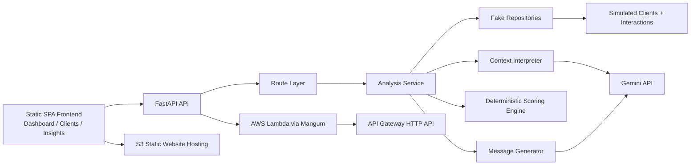

# Agentic Client Guardian
## AI Retention Engine for Financial Advisors

## Overview
Agentic Client Guardian is a full-stack study project designed as a realistic product MVP for financial advisory retention workflows.

The system analyzes simulated client behavior, estimates churn risk, prioritizes accounts, recommends the next best action, and generates advisor-ready personalized messages. It was built as a portfolio-grade technical project with clear business logic, resilient AI integration, public cloud deployment, validation, and teardown.

This repository intentionally demonstrates the full engineering cycle:

- backend architecture and domain modeling
- deterministic scoring and operational decisioning
- Gemini integration with retry and fallback
- modern frontend experience
- serverless deployment on AWS
- public demo validation
- cleanup procedures for zero residual cost

## Problem
Financial advisors need to retain client relationships before disengagement becomes visible in hard outcomes.

In practice, churn signals are fragmented across:

- CRM notes
- recent interactions
- client sentiment
- contribution behavior
- product maturity timing
- operational follow-up gaps

That creates two recurring problems:

- prioritization becomes reactive instead of proactive
- communication quality depends too much on manual interpretation

## Solution
Agentic Client Guardian proposes a lightweight AI-assisted retention engine.

The platform combines structured client data, recent interactions, context interpretation, deterministic risk scoring, and message generation into a single operational workflow. Even when the LLM is unavailable, the platform continues to operate through a fully validated fallback path.

Core business outcome:

- identify who needs attention
- explain why
- recommend what to do next
- help the advisor act immediately

## Key Features
- Layered backend architecture built with FastAPI and Pydantic
- Deterministic churn and priority engine with transparent business rules
- Gemini integration with retry strategy and safe fallback
- Full analysis endpoint at `POST /clients/{id}/analyze`
- Fake data layer for repeatable MVP testing without a real database
- Personalized message generation in Brazilian Portuguese
- Modern static SPA frontend with `Dashboard`, `Clients`, and `Insights`
- Stitch-inspired fintech visual system with loading and error states
- AWS serverless deployment with Lambda + API Gateway via SAM
- Static frontend publishing through S3 website hosting
- Docker, Docker Compose, GitHub Actions CI, and automated tests
- `pytest` suite with `36` passing tests

## Architecture


The backend was developed with a layered approach:

- `db/` for deterministic fake data and repository abstraction
- `models/` and `schemas/` for strong typing and API contracts
- `services/` for scoring, interpretation, orchestration, and message generation
- `api/` for FastAPI routing and response handling

The primary end-to-end flow is:

1. load a client
2. load recent interactions
3. interpret context with Gemini when available
4. fall back to local heuristics when needed
5. consolidate operational signals
6. score churn and priority
7. generate an advisor-ready message

## Tech Stack
- Backend: FastAPI, Python 3.11+, Pydantic, HTTPX
- AI: Gemini API with retry and fallback
- Frontend: Static SPA in HTML/CSS/JavaScript, inspired by Stitch design output
- Additional local UI: Streamlit dashboard for exploratory demo flow
- Infrastructure: AWS Lambda, API Gateway HTTP API, AWS SAM
- Static hosting: Amazon S3 static website hosting
- Containerization: Docker, Docker Compose
- CI: GitHub Actions
- Testing: pytest

## Project Structure
```text
agentic-client-guardian/
  app/
    api/
    core/
    db/
    models/
    prompts/
    schemas/
    services/
    utils/
    lambda_handler.py
    main.py
  frontend/
    index.html
  tests/
  dashboard.py
  Dockerfile
  docker-compose.yml
  requirements.txt
  requirements-dev.txt
  template.yaml
  README.md
```

## API Endpoints
| Method | Endpoint | Purpose |
|---|---|---|
| `GET` | `/health` | Health check |
| `GET` | `/clients` | List all simulated clients |
| `GET` | `/clients/{client_id}` | Retrieve one simulated client |
| `GET` | `/clients/{client_id}/interactions` | Retrieve client interactions |
| `POST` | `/clients/{client_id}/analyze` | Run full client analysis |
| `GET` | `/daily-priorities` | Return accounts sorted by operational priority |

Example requests:

```bash
curl http://127.0.0.1:8000/health
```

```bash
curl http://127.0.0.1:8000/clients
```

```bash
curl -X POST http://127.0.0.1:8000/clients/client-001/analyze
```

```bash
curl http://127.0.0.1:8000/daily-priorities
```

## Local Setup
1. Clone the repository and enter the project folder.

```bash
git clone <your-repo-url>
cd agentic-client-guardian
```

2. Create and activate a virtual environment.

```bash
python -m venv .venv
.venv\Scripts\activate
```

3. Install development dependencies.

```bash
pip install -r requirements-dev.txt
```

4. Create a local environment file from the template.

```bash
copy .env.example .env
```

5. Run the API locally.

```bash
uvicorn app.main:app --reload
```

6. Open the API docs.

```text
http://127.0.0.1:8000/docs
```

Environment variables:

```env
GEMINI_API_KEY=your_gemini_api_key_here
GEMINI_MODEL=gemini-2.5-flash
```

No API key is hardcoded in this repository. If `GEMINI_API_KEY` is missing, the application continues to work through the fallback path.

## Running with Docker
Build the API image:

```bash
docker build -t agentic-client-guardian .
```

Run the API container:

```bash
docker run --rm -p 8000:8000 --env-file .env agentic-client-guardian
```

Run the local stack with Docker Compose:

```bash
docker compose up --build
```

This project also includes:

- API containerization for local parity
- compose support for local demo orchestration
- CI-compatible dependency setup

## Frontend Usage
The frontend evolved from a simple demo surface into a modern SPA with three primary views:

- `Dashboard`
- `Clients`
- `Insights`

The production-style frontend lives in [frontend/index.html](C:/Users/vitor/OneDrive/Documentos/Playground/agentic-client-guardian/frontend/index.html) and was designed as a polished static interface for presentation, screenshots, and public demonstration.

Capabilities included in the frontend:

- multi-view navigation
- loading states
- error states
- public API consumption
- client detail rendering
- action/message flow
- insights visualization

For local API-served usage, the backend exposes the static frontend under:

```text
http://127.0.0.1:8000/ui/
```

An additional exploratory interface is also available through Streamlit:

```bash
streamlit run dashboard.py
```

## AWS Deployment (Serverless)
The backend was adapted for serverless deployment using AWS Lambda + API Gateway with Mangum and AWS SAM.

Relevant files:

- [app/lambda_handler.py](C:/Users/vitor/OneDrive/Documentos/Playground/agentic-client-guardian/app/lambda_handler.py)
- [template.yaml](C:/Users/vitor/OneDrive/Documentos/Playground/agentic-client-guardian/template.yaml)

Deployment flow:

```bash
sam build --use-container
sam deploy --guided
```

Or non-interactively:

```bash
sam deploy --stack-name agentic-client-guardian-demo --resolve-s3 --capabilities CAPABILITY_IAM --no-confirm-changeset --no-fail-on-empty-changeset --parameter-overrides EnvironmentName=demo GeminiModel=gemini-2.5-flash
```

Serverless implementation highlights:

- FastAPI adapted to Lambda through `Mangum`
- API Gateway HTTP API trigger
- environment-based Gemini configuration
- no secret hardcoding
- fallback behavior validated without `GEMINI_API_KEY`
- CORS configured correctly in FastAPI and API Gateway
- `OPTIONS` support enabled for external frontend consumption

## AWS Public Demo
This project was deployed publicly as a temporary demonstration to validate the full product loop from implementation to cloud delivery.

The demo included:

- SAM stack: `agentic-client-guardian-demo`
- Lambda function: `agentic-client-guardian-d-AgenticClientGuardianFun-W1y7QvyrVGy9`
- API Gateway HTTP API: `xkskagocii`
- S3 frontend bucket: `agentic-client-guardian-demo-ui-872515280667-20260322`
- static website hosting with published `index.html`

What was validated during the public demo:

- API health endpoint
- client listing
- daily priorities queue
- full analysis flow through `/clients/{id}/analyze`
- frontend integration against the public API
- CORS behavior for an external frontend origin
- fallback flow when `GEMINI_API_KEY` was not configured

Important note:

- the public deployment was temporary and intended only for demo screenshots and validation
- no real client data was ever used
- no API key or secret was exposed
- this README documents what was done, even if the public resources are no longer active

## Validation & Testing
Validation was performed locally and in AWS.

Automated test status:

- `36 passed`

Run tests locally:

```bash
pytest
```

Validated endpoints:

- `GET /health`
- `GET /clients`
- `GET /daily-priorities`
- `POST /clients/{id}/analyze`

Validated behaviors:

- full fallback operation without Gemini
- public API access through AWS
- external frontend consuming the public API
- CORS and preflight behavior
- local Docker and Compose execution

Example validation commands:

```bash
curl https://xkskagocii.execute-api.us-east-1.amazonaws.com/health
```

```bash
curl https://xkskagocii.execute-api.us-east-1.amazonaws.com/clients
```

```bash
curl -X POST https://xkskagocii.execute-api.us-east-1.amazonaws.com/clients/client-001/analyze
```

## Cleanup
The public AWS deployment was temporary and should be removed after demonstration to guarantee zero ongoing cost.

Primary resources to remove:

- CloudFormation stack: `agentic-client-guardian-demo`
- S3 static frontend bucket: `agentic-client-guardian-demo-ui-872515280667-20260322`

Remove the serverless backend stack:

```bash
sam delete --stack-name agentic-client-guardian-demo
```

If the frontend bucket still exists, remove its objects and delete it:

```bash
aws s3 rm s3://agentic-client-guardian-demo-ui-872515280667-20260322 --recursive
aws s3api delete-bucket --bucket agentic-client-guardian-demo-ui-872515280667-20260322 --region us-east-1
```

After cleanup, validate that no project-specific resources remain:

```bash
aws lambda list-functions --query "Functions[?contains(FunctionName, 'agentic-client-guardian')].[FunctionName]"
```

```bash
aws apigatewayv2 get-apis --query "Items[?contains(Name, 'agentic-client-guardian') || ApiId=='xkskagocii'].[Name,ApiId]"
```

```bash
aws s3api list-buckets --query "Buckets[?contains(Name, 'agentic-client-guardian')].[Name]"
```

Important:

- do not remove the shared SAM managed source bucket unless you explicitly want to clean unrelated SAM artifacts too
- once the stack and demo bucket are removed, the project returns to zero AWS cost for this demo setup

## Future Improvements
- Replace fake repositories with a real persistence layer
- Add authentication, advisor tenancy, and role-based access
- Store analysis history and intervention outcomes
- Introduce batch analysis and scheduled retention jobs
- Add richer observability for prompts, retries, and fallback rates
- Add a production-grade frontend build pipeline instead of a single static file
- Expand contract and browser-based integration tests
- Add configurable CORS origins for hardened production deployment

## Disclaimer
This is a portfolio and study project built to simulate a realistic financial advisory retention product.

- no real customer data is used
- no production advisory system is integrated
- recommendations are demonstrative and require human review
- generated messages are operational aids, not financial advice
- cloud deployment steps documented here were intentionally temporary and cleaned up after validation
